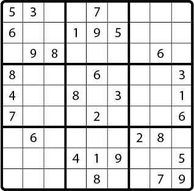

# Судоку

## Введение



*Рисунок 1*. Анимация решения.

Судоку – логическая комбинаторная головоломка, которую необходимо решать при помощи чисел.  Она представляет собой решетку из клеток 3×3 и содержит цифры от 1 до 9.

Как правило, судоку частично предоставляет решение, которое выражается в виде уже заполненных числами клеток. Чтобы решить головоломку, нужно заполнить пустые квадраты так, как это показано на Рисунке 1.

К концу этой задачи у вас будет полностью функционирующий «решатель» Судоку, который запускается из командной строки. Вам будут представлены 15 нерешенных головоломок Судоку. Пазлы можно найти в файле `sudoku-puzzles.txt`.

* Пять головоломок могут быть решены с помощью базовой логики.
* Пять требуют немного более продвинутой логики.
* Пять требуют от вашего решателя умения угадывать и перерешивать, если зашёл в тупик.

Полное решение разрешит все 15 головоломок.

### Ограничения

Никаких глобальных переменных -  вы будете использовать только локальные переменные.
Для этого вы будете писать функции, которые принимают параметры в качестве входных данных и возвращают посчитанные значения. Вы должны написать большое количество функций и использовать их вместе для создания своего «судоку-решателя».


## Тестирование

Хорошие новости: вы создадите много небольших методов, а небольшие методы легче тестировать!

Количество тестов, которые Вы пишете, полностью зависит от Вас. Тестирование выполняется исключительно для Вас и поможет Вам писать код. Вы должны находить баланс между тестированием и необходимостью писать код. Помните, что тесты могут помочь вам быстрее достичь нужных результатов.


## Releases

### Pre-release: Понимание и моделирование Судоку

Компьютерная программа, которая решает Судоку, имитирует человека, играющего в нее. Понимание того, как человек играет в игру, является ключевым. Что делает человек при решении Судоку?

Давайте сыграем в настоящую головоломку Судоку, обращая внимание на то, как мы приближаемся к решению поставленной задачи.

- Какие стратегии мы принимаем и почему?
- Как мы выбираем, с чего начать?
- Как мы узнаем, когда действительно следует поставить число в клетку?
- Что мы делаем, когда мы окончательно не знаем, как заполнить остальные клетки?

Размышляя о нашей человеческой стратегии, важно понимать, что иногда стратегии, которые работают для людей, будет трудно реализовать на компьютере. Однако верно и обратное: стратегии компьютера могут быть не всегда удобны для людей, потому что нам придется писать слишком много текста, использовать слишком много листов бумаги или помнить много информации, которую в состоянии запомнить компьютер, но не человек.

Прежде чем вы начнете писать код, разработайте и напишите решение при помощи псевдокода для вашего «решателя».

### Release 0: Основная логика

Первые пять головоломок в файле `sudoku-puzzles.txt` могут быть решены с помощью базовой логики (многие клетки в начале игры имеют только одно возможное значение). Для этого релиза надо, чтобы программа могла решить первые пять головоломок.

- Создайте функции, которые будут работать вместе для решения головоломок. Несколько функций уже есть для Вас в `sudoku.js`.
- Чтобы запустить «решатель», используйте `runner.js`, который использует функции из `sudoku.js`. Убедитесь, что Вы прочитали комментарии и код в `runner.js` и `sudoku.js`.
- Функция `solve` в `sudoku.js` примет строку `String`, представляющую собой чистую доску Судоку. Неразрешенные квадраты отмечены символом ` - `. Решенные квадраты содержат в себе цифру от «1» до «9». Например:
  `"1-58-2----9--764-52--4--819-19--73-6762-83-9-----61-5---76---3-43--2-5-16--3-89---"`

- Для этого релиза Ваша программа должна «сдаваться», если ей не удается решить задачу.
- Обязательно напишите метод `prettyBoard`, который берет доску, записанную в строчку и возвращает отформатированный вариант, более привычный для нашего визуального восприятия. Например:

```
1 - 5 8 - 2 - - -
- 9 - - 7 6 4 - 5
2 - - 4 - - 8 1 9
- 1 9 - - 7 3 - 6
7 6 2 - 8 3 - 9 -
- - - - 6 1 - 5 -
- - 7 6 - - - 3 -
4 3 - - 2 - 5 - 1
6 - - 3 - 8 9 - -
```
### Release 1: Более продвинутая логика

Головоломки 6-10 могут быть решены с использованием обычной логики, но при этом требуют больше, чем просто последовательный перебор клеток, которые могут иметь только одно возможное значение. Требуется улучшить механизм, чтобы программа могла решать эти новые головоломки.

*Примечание:* Ваш код все равно должен «сдаваться», если он не справляется с головоломкой.

### Release 2: «Умное» угадывание

Головоломки 11-15 можно решить, делая обоснованные предположения о значениях неразрешенных квадратов, а затем пытаясь решить головоломки на основе этих уже угаданных значений. Угадывание должно начинаться после того, как Ваш основной код пройдет по всему полю Судоку и найдет все очевидные значения, либо сделает предположения о возможных значениях. Другими словами, подберите значения в как можно большем количестве клеток с помощью логики, а затем начинайте угадывать. Многие считают, что тут может сильно помочь рекурсия.

## Выводы

Написание решения Судоку заключает в себе множество проблем: определение логики, связанной с самой игрой, перекладывание этой логики на код, манипулирование структурами данных и т.д. Это обеспечивает хорошую всеобъемлющую задачу, суммируя навыки, которые мы развили до этого момента в Elbrus Bootcamp.
